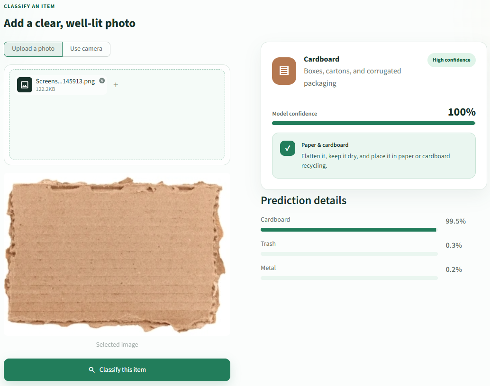
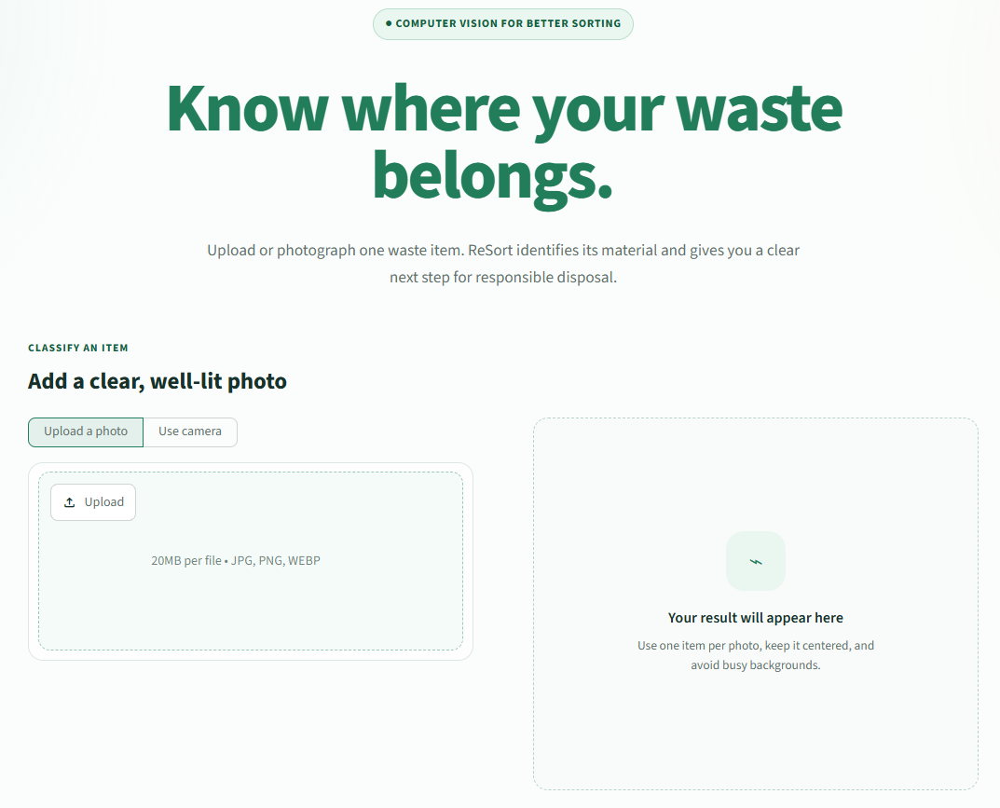
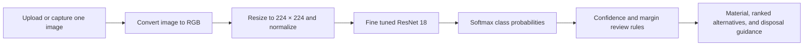
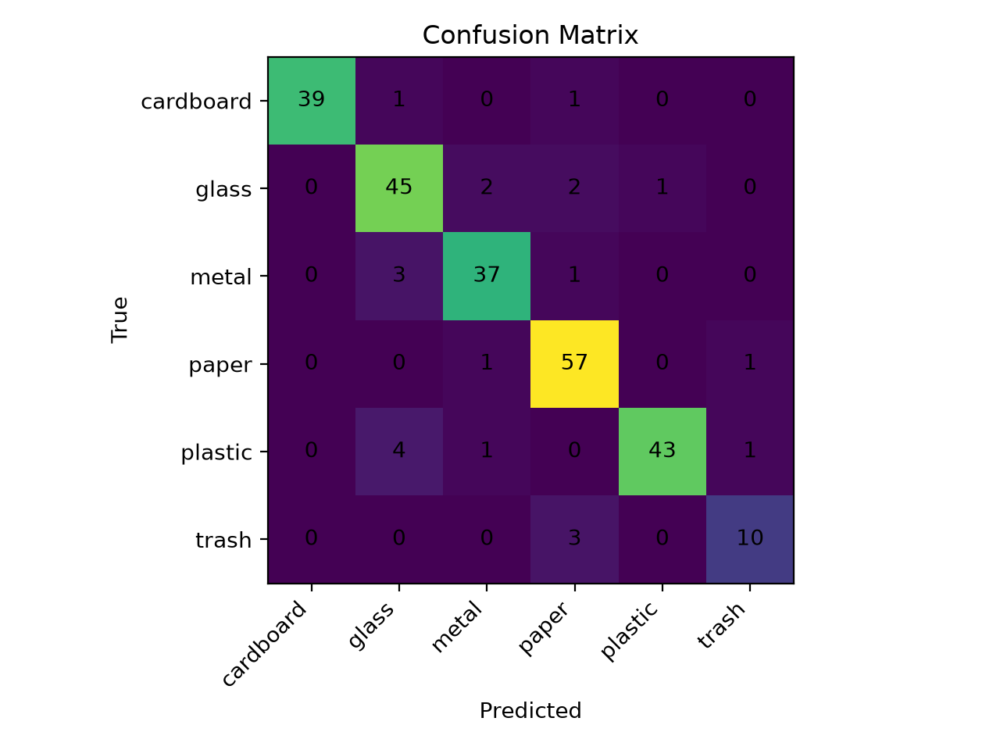
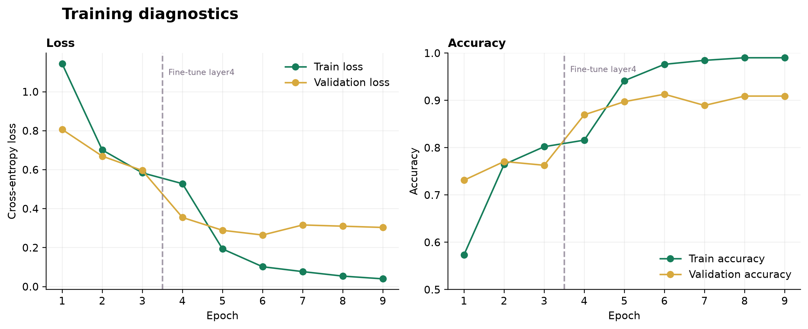
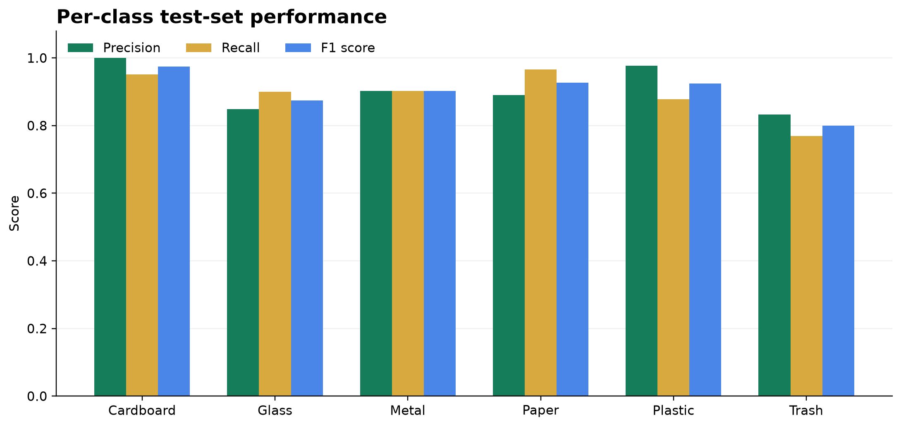
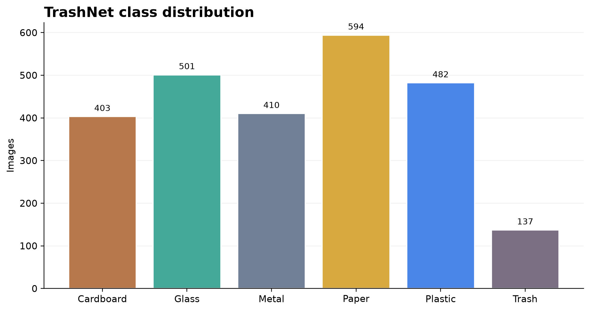

<div align="center">

# ReSort AI Waste Classifier

### Turn one waste photo into a clearer disposal decision.

ReSort is a computer vision web app that identifies a household waste material, communicates prediction confidence, and suggests an appropriate disposal route.

[Live demo](https://resort-trash-classifier.streamlit.app/) · [Repository](https://github.com/LecyLecy/python-trash-classifier) · [TrashNet dataset](https://github.com/garythung/trashnet)

</div>

## Overview

ReSort is an end to end machine learning application for classifying a single waste item into one of six material categories: cardboard, glass, metal, paper, plastic, or general trash. It is designed to make the model output more useful than a label alone by showing confidence, alternative predictions, and material specific disposal guidance.

The workflow is intentionally small and focused:

* A user uploads an image or captures one with a camera.
* The image is converted to RGB, resized, normalized, and passed to a fine tuned ResNet 18 classifier.
* The app ranks the most likely materials and evaluates whether the result needs human review.
* The user receives a predicted material and practical guidance for the relevant waste stream.

## Product experience

The result view combines the selected image, predicted class, confidence indicator, ranked alternatives, and a recommended disposal route in one place.



The empty state gives users clear framing guidance before they submit an image.



### Key features

* Image upload and camera capture for single item classification.
* Six material categories based on TrashNet: cardboard, glass, metal, paper, plastic, and trash.
* Top three predictions so users can see plausible alternatives.
* Confidence and margin based review logic for ambiguous predictions.
* A dedicated review path for the glass and plastic pair, which can be visually similar.
* Material specific disposal guidance written for a general audience.
* Training and evaluation artifacts that document model behaviour.

## How it works



## Technical methodology

### Data preparation

The project uses the [TrashNet dataset](https://github.com/garythung/trashnet), which contains 2,527 images across six waste categories. Samples are split with stratification and a fixed seed of 42 into 80% training, 10% validation, and 10% testing partitions. Stratification keeps each material category represented in each split.

Training images are resized to 224 × 224 pixels, randomly flipped horizontally, and augmented with controlled brightness, contrast, saturation, and hue variation. Evaluation and inference use deterministic resizing and ImageNet normalization. This keeps training more robust to small visual changes while making validation and production predictions repeatable.

### Model training

The classifier uses ResNet 18 with ImageNet pretrained weights. Its final fully connected layer is replaced with a six class output layer. Training uses two phases:

1. Train only the classifier head for three epochs while the ResNet feature extractor remains frozen.
2. Fine tune the final residual block and classifier head with a lower learning rate.

AdamW is used with a learning rate of 0.001 for the first phase, 0.0001 for fine tuning, and weight decay of 0.0001. Early stopping tracks validation accuracy during the fine tuning phase and retains the strongest checkpoint. This approach adapts useful visual features from ImageNet without updating the entire network aggressively from the start.

### Prediction and review logic

The inference layer converts logits to probabilities with softmax and returns the top three classes. A prediction requests review when its confidence is below 60%, when the difference between the first and second predictions is below 15 percentage points, or when glass and plastic are the top two classes. The user can then inspect the alternatives and select a material manually.

## Model performance

The model achieved 91.3% accuracy on the held out test partition. Weighted F1 is also 91.3%, indicating that performance remains strong after weighting each class by its number of test images.

| Metric | Test result |
| --- | ---: |
| Best validation accuracy | 91.3% |
| Held out test accuracy | 91.3% |
| Weighted F1 score | 91.3% |
| Macro F1 score | 90.0% |
| Test images | 253 |

Cardboard has the strongest per class F1 score at 97.5%. The trash class has the lowest F1 score at 80.0% and only 13 test images, so it is the clearest area for additional data collection. The model can also confuse visually related materials such as glass, plastic, and metal, which is why the interface exposes alternatives and review guidance instead of treating every output as certain.



### Training diagnostics

The plots below make the training progression, class balance, and per class performance inspectable from the repository.







## Technology

| Area | Tools |
| --- | --- |
| Interface | Streamlit, Python |
| Model and inference | PyTorch, Torchvision, Pillow |
| Training and evaluation | scikit learn, NumPy, Matplotlib, tqdm |
| Deployment | Streamlit Community Cloud |

## Repository structure

```text
.
├── app.py                         # Streamlit interface and presentation logic
├── inference/
│   ├── api.py                     # Model loading, prediction, and review rules
│   └── predict.py                 # Command line inference
├── src/ml/
│   ├── config.py                  # Paths, split settings, and training configuration
│   ├── dataset.py                 # Dataset wrapper and image transforms
│   ├── model.py                   # ResNet 18 classifier definition
│   ├── train.py                   # Two phase training pipeline
│   └── eval.py                    # Held out evaluation and confusion matrix
├── models/
│   ├── labels.json                # Class order used at inference
│   └── model.pth                  # Trained model weights
├── metrics/                       # Reports, plots, and training log
├── figures/                       # README application screenshots
├── scripts/
│   └── generate_metric_plots.py   # Regenerates portfolio diagnostics
├── tests/
│   └── test_inference.py          # Review logic unit tests
└── notebooks/
    └── EDA.ipynb                  # Exploratory analysis notebook
```

## Run locally

Python 3.11 is recommended.

### Windows PowerShell

```powershell
git clone https://github.com/LecyLecy/python-trash-classifier.git
cd python-trash-classifier

py -3.11 -m venv .venv
.\.venv\Scripts\Activate.ps1
python -m pip install --upgrade pip
pip install -r requirements.txt

streamlit run app.py
```

### macOS or Linux

```bash
git clone https://github.com/LecyLecy/python-trash-classifier.git
cd python-trash-classifier

python3.11 -m venv .venv
source .venv/bin/activate
python -m pip install --upgrade pip
pip install -r requirements.txt

streamlit run app.py
```

## Train and evaluate

Training dependencies are kept separate from the smaller deployment environment. Download `dataset-resized.zip` from the [TrashNet data repository](https://github.com/garythung/trashnet/tree/master/data), extract it, and arrange the classes under `data/trashnet/raw/`.

```text
data/trashnet/raw/
├── cardboard/
├── glass/
├── metal/
├── paper/
├── plastic/
└── trash/
```

Then run:

```powershell
pip install -r requirements-train.txt
python -m src.ml.train
python -m src.ml.eval
python scripts/generate_metric_plots.py
```

Training writes `models/model.pth`, `models/labels.json`, and `metrics/train_log.csv`. Evaluation writes `metrics/classification_report.json` and `metrics/confusion_matrix.png`. The plotting script recreates the diagnostic figures used in this README.

## Command line inference

```powershell
python inference/predict.py path/to/image.jpg
```

## Testing and validation

The unit tests verify the decision policy around confidence, close predictions, and the glass and plastic review case.

```powershell
python -m unittest discover -s tests -v
```

## Limitations

* TrashNet images are relatively controlled and may not represent every lighting condition, background, camera quality, or contaminated item seen in everyday use.
* The general trash category is the smallest class in the evaluation split, which limits confidence in its reported performance.
* Recycling rules differ between municipalities. The guidance is a material level recommendation, not local policy advice.
* Confidence is a model probability, not a guarantee that an item is accepted by a local recycling service.

## Future improvements

* Collect more varied and locally representative images, especially for general trash and visually similar materials.
* Add location aware recycling guidance from verified municipal sources.
* Add calibration analysis to make confidence estimates easier to interpret.
* Track opt in feedback to identify recurring prediction errors and guide retraining.

## Data, attribution, and license

This project uses [TrashNet](https://github.com/garythung/trashnet) for waste images and Torchvision's ImageNet pretrained ResNet 18 weights for transfer learning. Please review the upstream data and model terms before redistributing derived work.

No license file is currently included in this repository. Add a license before granting reuse rights to others.
