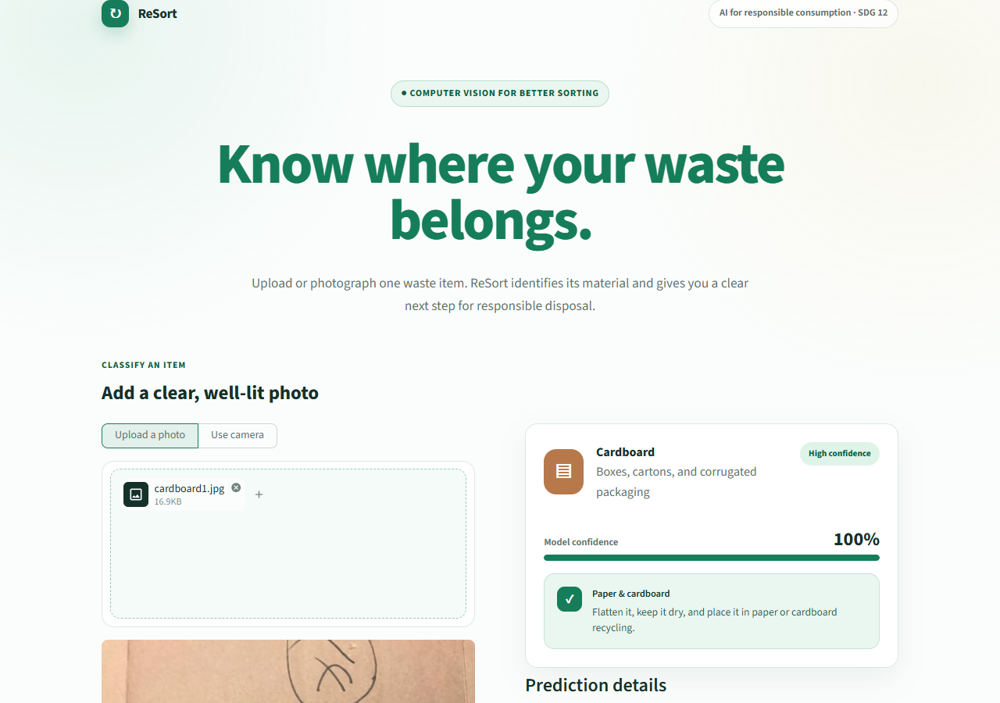

# ReSort — AI Waste Classifier

ReSort is a portfolio-ready computer vision app that identifies common household waste and turns a prediction into practical disposal guidance. It uses a fine-tuned ResNet-18 model, a transparent confidence layer, and a responsive Streamlit interface.

> **Live demo:** [resort-trash-classifier.streamlit.app](https://resort-trash-classifier.streamlit.app/)



## What it does

- Classifies one image into six TrashNet categories: cardboard, glass, metal, paper, plastic, or general trash.
- Accepts uploaded images and live camera captures.
- Shows model confidence and the leading alternative predictions.
- Flags uncertain or commonly confused results for human review.
- Provides plain-English disposal guidance for every category.
- Presents validation metrics and model context directly in the interface.

## Model performance

| Metric | Result |
| --- | ---: |
| Best validation accuracy | 91.3% |
| Held-out test accuracy | 91.3% |
| Weighted F1 score | 91.3% |
| Test images | 253 |

The model uses transfer learning with ImageNet-pretrained ResNet-18 weights and is fine-tuned on the [TrashNet dataset](https://github.com/garythung/trashnet). The dataset contains 2,527 images across six material categories. Training first fits the classifier head with a frozen backbone, then fine-tunes the final residual block at a lower learning rate. Early stopping preserves the strongest validation checkpoint.

### Confusion matrix


Per-class precision, recall, and F1 scores are available in [`metrics/classification_report.json`](metrics/classification_report.json). The interface also exposes uncertainty rather than presenting every prediction as equally reliable.

## Project structure

```text
.
├── app.py                    # Streamlit experience
├── inference/
│   ├── api.py                # Prediction and review logic
│   └── predict.py            # Minimal CLI inference
├── src/ml/
│   ├── config.py             # Training configuration
│   ├── dataset.py            # Dataset and transforms
│   ├── model.py              # ResNet-18 architecture
│   ├── train.py              # Training pipeline
│   └── eval.py               # Evaluation and confusion matrix
├── models/
│   ├── labels.json
│   └── model.pth             # Trained weights
├── metrics/                  # Evaluation artifacts
└── notebooks/EDA.ipynb
```

## Run the app locally

Python 3.11 is recommended.

### Windows PowerShell

```powershell
git clone https://github.com/LecyLecy/python-trash-classifier.git
cd python-trash-classifier

py -3.11 -m venv .venv
.\.venv\Scripts\Activate.ps1
python -m pip install --upgrade pip
pip install -r requirements.txt

streamlit run app.py
```

### macOS or Linux

```bash
git clone https://github.com/LecyLecy/python-trash-classifier.git
cd python-trash-classifier

python3.11 -m venv .venv
source .venv/bin/activate
python -m pip install --upgrade pip
pip install -r requirements.txt

streamlit run app.py
```

## Train the model

Training dependencies are kept separate from the lighter deployment environment.

```powershell
pip install -r requirements-train.txt
```

Download `dataset-resized.zip` from the [TrashNet repository](https://github.com/garythung/trashnet/tree/master/data), extract it, and arrange the images as follows:

```text
data/trashnet/raw/
├── cardboard/
├── glass/
├── metal/
├── paper/
├── plastic/
└── trash/
```

Then run:

```powershell
python -m src.ml.train
python -m src.ml.eval
```

The training command writes `models/model.pth`, `models/labels.json`, and the training log. Evaluation writes the classification report and confusion matrix to `metrics/`.

## CLI inference

```powershell
python inference/predict.py path/to/image.jpg
```

## Responsible use

ReSort is an educational project, not an authority on local recycling rules. Confidence scores are not guarantees, and recycling policies vary by municipality. The interface deliberately recommends review when the prediction is weak or ambiguous.

## Tech stack

Python · PyTorch · Torchvision · Streamlit · Pillow · scikit-learn · Matplotlib
